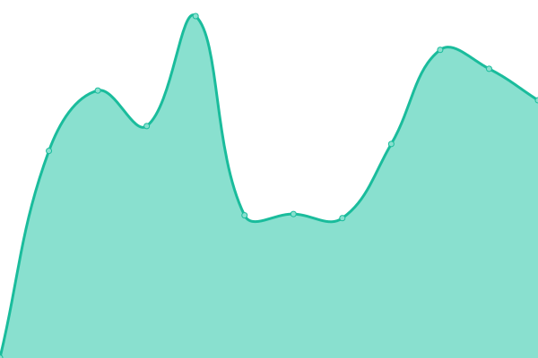
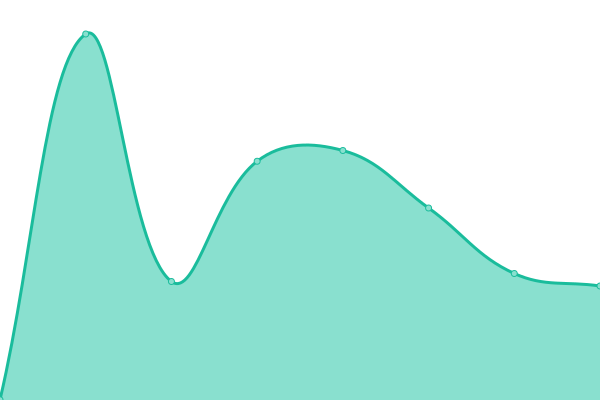
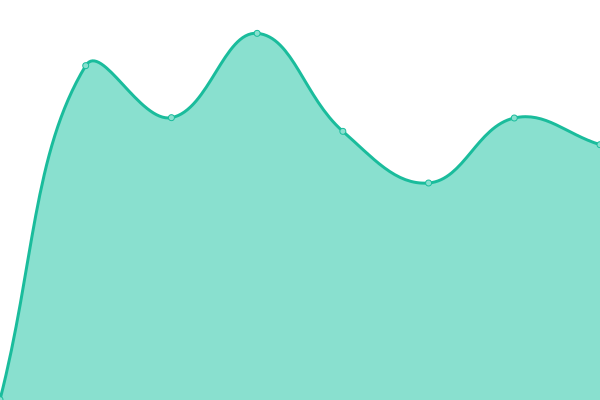

# [📈 Live Status](https://demo.upptime.js.org): <!--live status--> **🟩 All systems operational**

This repository contains the open-source uptime monitor and status page for [Robert10B](https://10dsgn.nl), powered by [Upptime](https://github.com/upptime/upptime).

With [Upptime](https://upptime.js.org), you can get your own unlimited and free uptime monitor and status page, powered entirely by a GitHub repository. We use [Issues](https://github.com/tendsgn/upptime/issues) as incident reports, [Actions](https://github.com/tendsgn/upptime/actions) as uptime monitors, and [Pages](https://demo.upptime.js.org) for the status page.

<!--start: status pages-->
<!-- This summary is generated by Upptime (https://github.com/upptime/upptime) -->
<!-- Do not edit this manually, your changes will be overwritten -->
<!-- prettier-ignore -->
| URL | Status | History | Response Time | Uptime |
| --- | ------ | ------- | ------------- | ------ |
|  [Beeldoverleg Website](https://beeldoverleg.nl) | 🟩 Up | [beeldoverleg-website.yml](https://github.com/tendsgn/upptime/commits/HEAD/history/beeldoverleg-website.yml) | 

 2076ms
     
 | 

<a href="https://tendsgn.github.io/upptime/history/beeldoverleg-website">96.46%</a>
    

|  [Beeldoverleg Sessie](https://sessie.beeldoverleg.nl/uptime) | 🟩 Up | [beeldoverleg-sessie.yml](https://github.com/tendsgn/upptime/commits/HEAD/history/beeldoverleg-sessie.yml) | 

 802ms
     
 | 

<a href="https://tendsgn.github.io/upptime/history/beeldoverleg-sessie">100.00%</a>
    

|  [GgzPraktijk](https://ggzpraktijk.nl) | 🟩 Up | [ggz-praktijk.yml](https://github.com/tendsgn/upptime/commits/HEAD/history/ggz-praktijk.yml) | 

 946ms
     
 | 

<a href="https://tendsgn.github.io/upptime/history/ggz-praktijk">100.00%</a>
    

<!--end: status pages-->

[**Visit our status website →**](https://demo.upptime.js.org)

## 📄 License

- Powered by: [Upptime](https://github.com/upptime/upptime)
- Code: [MIT](./LICENSE) © [Anand Chowdhary](https://anandchowdhary.com), supported by [Pabio](https://pabio.com)
- Data in the `./history` directory: [Open Database License](https://opendatacommons.org/licenses/odbl/1-0/)
